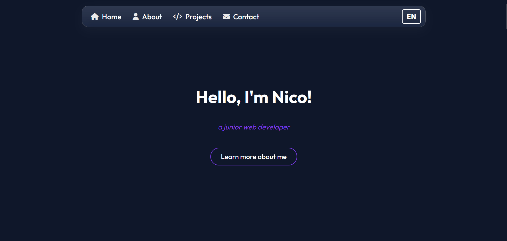

# 🎨 Portfolio - Nicolas Drew

Welcome to the repository of my personal portfolio!  
This project showcases my journey as a **junior web developer**, with a focus on **modern design, accessibility, and responsive layouts**.

🔗 **Live Demo:** [nicolas-drew.github.io/Portfolio](https://nicolas-drew.github.io/Portfolio/)

---

## 🖼️ Preview

---

## 💡 About

This portfolio started as part of the **Responsive Web Design Certification** by [freeCodeCamp](https://www.freecodecamp.org/), and has since evolved into a more complete and interactive project.  

It is now built with:  

📌 **Main features**:  
- 🌍 EN/FR language switch  
- 📱 Fully responsive layout  
- ♿ Accessibility-friendly design  
- 🧩 Project showcase with live demos  

---

## 📫 Contact

- 👤 [GitHub profile](https://github.com/nicolas-drew)  
- 📧 Via the contact section on the portfolio  

---

Thanks for visiting! 🙌
